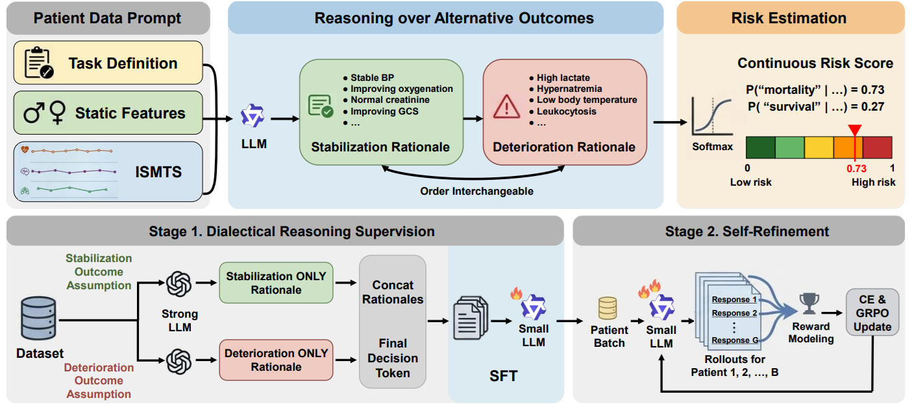

# TRIAGE

[](https://arxiv.org/abs/2606.09030v1) &nbsp;[](#citation) &nbsp;[](https://huggingface.co/collections/Hyeongwon/triage)

[**TRIAGE: Dialectical Reasoning for Explainable Risk Prediction on Irregularly Sampled Medical Time Series with LLMs**](https://arxiv.org/abs/2606.09030v1)

by Hyeongwon Jang<sup>1\*</sup>, Gyouk Chu<sup>1\*</sup>, Changhun Kim<sup>2,3</sup>, Joonhyung Park<sup>1</sup>, Hangyul Yoon<sup>1</sup>, and Eunho Yang<sup>1,2</sup>  
<sup>1</sup>Korea Advanced Institute of Science & Technology &nbsp;&nbsp; <sup>2</sup>AITRICS &nbsp;&nbsp; <sup>3</sup>University of Wisconsin–Madison &nbsp;&nbsp; <sup>\*</sup>Equal Contribution

> This is the **main repository**, covering **data preprocessing** and the **SFT** stage of TRIAGE. The **RL post-training** stage is more involved and lives in a separate repository: follow [**GyoukChu/TRIAGE-RL**](https://github.com/GyoukChu/TRIAGE-RL) (built on [verl](https://github.com/volcengine/verl); 🚧 *will be released soon*). Model checkpoints (SFT and SFT+RL) are available on the [Hugging Face Hub](https://huggingface.co/collections/Hyeongwon/triage).

<p align="center">
  
</p>

## Overview

Clinical early warning over irregularly sampled medical time series (ISMTS) needs both **calibrated risk scores** and **rationales clinicians can verify**, yet LLMs tend to collapse graded risk into overconfident **binary** predictions (*risk polarization*). **TRIAGE** instead trains an LLM to produce **dialectical reasoning over competing clinical outcomes**: it elicits outcome-specific rationales and derives a **continuous, calibrated risk score** grounded in explicit clinical reasoning.

Across three ISMTS benchmarks (**P12**, **P19**, **MIMIC-III**), TRIAGE improves average **AUPRC by 3.3%** and reduces **calibration error by 81%** over competitive baselines, and an LLM-as-a-judge evaluation rates its rationales **20%** higher in clinical reasoning quality than post-hoc baseline explanations.

## Updates

- **2026-06-16**: Code released.
- **2026-06-08**: Paper and model checkpoints released.

## Models

All checkpoints are fine-tuned from [`Qwen/Qwen3-4B-Base`](https://huggingface.co/Qwen/Qwen3-4B-Base) and released under CC BY-NC 4.0.

| Model | Data | Prediction task | Training |
|---|---|---|---|
| [TRIAGE-4B-P12-SFT](https://huggingface.co/Hyeongwon/TRIAGE-4B-P12-SFT) | P12 | In-hospital mortality | SFT |
| [TRIAGE-4B-P12-SFT-RL](https://huggingface.co/Hyeongwon/TRIAGE-4B-P12-SFT-RL) | P12 | In-hospital mortality | SFT + RL |
| [TRIAGE-4B-P19-SFT](https://huggingface.co/Hyeongwon/TRIAGE-4B-P19-SFT) | P19 | Sepsis early prediction | SFT |
| [TRIAGE-4B-P19-SFT-RL](https://huggingface.co/Hyeongwon/TRIAGE-4B-P19-SFT-RL) | P19 | Sepsis early prediction | SFT + RL |

**Repository layout.** Each model holds five splits in separate `split_N/` subfolders (`split_1` … `split_5`). For the `SFT-RL` models, per-split RL checkpoints were selected by validation AUPRC, and the SFT warm-start used to initialize RL is kept on each repo's `rl_init` branch.

MIMIC-III checkpoints are not listed above; as credentialed-access data, their release is under separate consideration (see the [Data & Preprocessing](#data-preprocessing) section).

### Quick start

```python
from transformers import AutoModelForCausalLM, AutoTokenizer

split = "split_1"  # one of split_1 ... split_5
repo  = "Hyeongwon/TRIAGE-4B-P19-SFT-RL"

tokenizer = AutoTokenizer.from_pretrained(repo, subfolder=split)
model     = AutoModelForCausalLM.from_pretrained(repo, subfolder=split, device_map="auto")
```

The models expect the same chat-style `prompt` used during training (see [Data](#data-preprocessing)).

## Repository Structure

```
TRIAGE/
├── data/
│   ├── P12/
│   │   ├── process_script/         # initial preprocessing (raw -> npy) + dataset description
│   │   └── triage_process_script/  # textualize -> batch requests -> SFT data
│   ├── P19/
│   │   ├── process_script/
│   │   └── triage_process_script/
│   └── mimic3/
│       ├── process_script/
│       └── triage_process_script/
├── recipes/
│   ├── accelerate_configs/
│   │   └── zero3.yaml              # DeepSpeed ZeRO-3 accelerate config
│   ├── p12_triage_sft_split1.yaml
│   ├── p19_triage_sft_split1.yaml
│   └── mimic3_triage_sft_seed42.yaml
├── utils.py                        # model / tokenizer / wandb helpers
├── configs.py                      # ScriptArguments + SFTConfig
└── sft.py                          # SFT entry point
```

## 🔧 Environment

We run on a single **H200** GPU.

**Base image**

```
docker.io/ocss884/verl-sglang:ngc-th2.6.0-cu126-sglang0.4.6.post5
```

**Additional packages** (inside the container)

```bash
pip install transformers==4.57.3 accelerate==1.7.0 trl==0.25.1 deepspeed==0.18.2
pip install -U bitsandbytes
```

<a id="data-preprocessing"></a>

## 📚 Data & Preprocessing

This repository provides the **data preprocessing pipeline** for TRIAGE. We start from the publicly available, Raindrop-preprocessed P12 and P19 datasets:

| Data | Original | Raindrop preprocessed |
|---|---|---|
| **P12** | [PhysioNet Challenge 2012](https://physionet.org/content/challenge-2012/1.0.0/), in-hospital mortality | [figshare](https://doi.org/10.6084/m9.figshare.19514341.v1) |
| **P19** | [PhysioNet Challenge 2019](https://physionet.org/content/challenge-2019/1.0.0/), sepsis early prediction | [figshare](https://doi.org/10.6084/m9.figshare.19514338.v1) |

These splits originate from [Raindrop](https://github.com/mims-harvard/Raindrop) and [ViTST](https://github.com/Leezekun/ViTST). For **MIMIC-III**, we follow the [KEDGN](https://github.com/easonLuo2001/KEDGN) preprocessing pipeline, which builds on [SeFT](https://github.com/ExpectationMax/medical_ts_datasets) (`medical_ts_datasets`).

> **MIMIC-III.** MIMIC-III is one of the three benchmarks evaluated in the paper, but it is distributed under a credentialed-access license (PhysioNet), and its derivatives cannot be redistributed openly. Public release of the MIMIC-III data and model checkpoints is therefore under separate consideration. The P12/P19 preprocessing and SFT pipeline released here applies directly to MIMIC-III once you have obtained credentialed access to the dataset.

Each dataset has a `data/<name>/process_script/` folder (initial preprocessing and a dataset description) and a `data/<name>/triage_process_script/` folder (textualization and SFT-data generation). See the per-dataset readmes: P12 ([process](data/P12/process_script/readme.md), [triage](data/P12/triage_process_script/readme.md)), P19 ([process](data/P19/process_script/readme.md), [triage](data/P19/triage_process_script/readme.md)), and MIMIC-III ([process](data/mimic3/process_script/readme.md), [triage](data/mimic3/triage_process_script/readme.md)).

**SFT data format.** `sft.py` consumes a JSON file (path set via `dataset_path` in the recipe) where each example has:

- **`prompt`**: a chat-style list, e.g. `[{"role": "user", "content": "..."}]`.
- **`completion`**: a chat-style list, e.g. `[{"role": "assistant", "content": "..."}]`, holding the dialectical rationales and the final 0/1 answer.
- **`MOR_label`** (P12, MIMIC-III) or **`SepsisLabel`** (P19): an `int` label (`0`/`1`) used by the class-balanced sampler.

## 🔥 Running SFT

After preparing the dataset JSON:

```bash
export HF_TOKEN=xxxx
export WANDB_API_KEY=xxxx   # optional, for Weights & Biases logging

accelerate launch \
    --config_file recipes/accelerate_configs/zero3.yaml \
    sft.py \
    --config recipes/p12_triage_sft_split1.yaml
```

[`recipes/p12_triage_sft_split1.yaml`](recipes/p12_triage_sft_split1.yaml) holds the P12 SFT config. The split shown is only an example: within a dataset the hyperparameters are the same for every split, so just point `dataset_path` at the split you want and set `hub_model_id`. P19 and MIMIC-III have their own recipes, [`recipes/p19_triage_sft_split1.yaml`](recipes/p19_triage_sft_split1.yaml) and [`recipes/mimic3_triage_sft_seed42.yaml`](recipes/mimic3_triage_sft_seed42.yaml) (MIMIC-III has one fixed split from KEDGN, so its recipe is named by the training seed).

## Inference & Evaluation

At evaluation time, inference is served with [SGLang](https://github.com/sgl-project/sglang) at temperature 0.7. To obtain a single continuous risk score, we run the dialectical reasoning in both orderings of the competing outcomes, take a probability from each ordering, and average the two.

## Acknowledgement

This project builds on the Hugging Face [TRL](https://github.com/huggingface/trl) library. The basic preprocessing for P12 and P19 follows [Raindrop](https://github.com/mims-harvard/Raindrop) and [ViTST](https://github.com/Leezekun/ViTST), and for MIMIC-III follows [SeFT](https://github.com/ExpectationMax/medical_ts_datasets) and [KEDGN](https://github.com/easonLuo2001/KEDGN). We thank the authors and maintainers of these projects.

## License

The code in this repository is released under the **Apache License 2.0** (see [LICENSE](LICENSE)), consistent with the upstream Hugging Face TRL code it builds on. Model checkpoints are released under **CC BY-NC 4.0** (non-commercial). Datasets remain under their respective licenses; see the links above.

## Citation

If you find this repository useful, please cite our paper:

```bibtex
@article{jang2026triage,
  title={TRIAGE: Dialectical Reasoning for Explainable Risk Prediction on Irregularly Sampled Medical Time Series with LLMs},
  author={Jang, Hyeongwon and Chu, Gyouk and Kim, Changhun and Park, Joonhyung and Yoon, Hangyul and Yang, Eunho},
  journal={arXiv preprint arXiv:2606.09030},
  year={2026}
}
```

## ✉️ Contact

If you have any questions or feedback, feel free to reach out:

- Hyeongwon Jang: janghw0911@kaist.ac.kr
- Gyouk Chu: kyouwook@kaist.ac.kr
