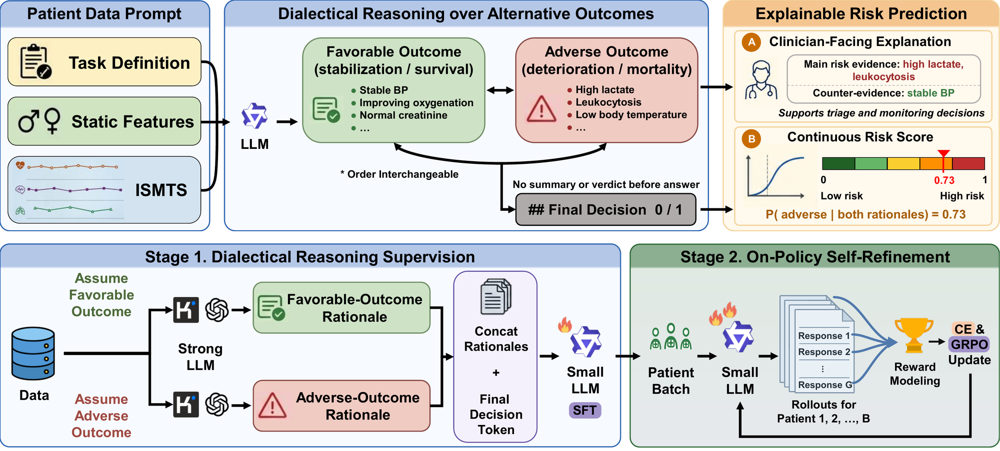

# TRIAGE

[](https://arxiv.org/abs/2606.09030) &nbsp;[](https://hyeongwon-jang.github.io/triage-project-page/) &nbsp;[](https://huggingface.co/collections/Hyeongwon/triage) &nbsp;[](LICENSE)

[**TRIAGE: Dialectical LLM Reasoning for Explainable Risk Prediction on Irregularly Sampled Medical Time Series**](https://arxiv.org/abs/2606.09030)

by Hyeongwon Jang<sup>1\*</sup>, Gyouk Chu<sup>1\*</sup>, Changhun Kim<sup>2,3</sup>, Hangyul Yoon<sup>1</sup>, Jeonguk Lee<sup>3</sup>, Eunho Yang<sup>1,3</sup>, and Joonhyung Park<sup>4†</sup>  
<sup>1</sup>KAIST AI &nbsp;&nbsp; <sup>2</sup>University of Wisconsin–Madison &nbsp;&nbsp; <sup>3</sup>AITRICS &nbsp;&nbsp; <sup>4</sup>Kyung Hee University &nbsp;&nbsp; <sup>\*</sup>Equal contribution &nbsp;&nbsp; <sup>†</sup>Corresponding author

<p align="center">
  
</p>

## Overview

Clinical early warning on irregularly sampled medical time series (ISMTS) from electronic health records asks for two things at once: continuous risk scores that order patients for triage, and rationales a clinician can check. Large language models are well placed for both, taking the risk score from their output probabilities and the rationale from their medical knowledge. But conventional LLM reasoning collapses graded risk into overconfident predictions, and that destroys the cross-patient comparability triage depends on. We call this failure mode *risk polarization* and trace it to two behaviours: committing early to a single outcome, and then reasoning only over the evidence for that outcome.

TRIAGE trains the model to reason dialectically over the competing outcomes instead, eliciting a rationale for each before it commits. That mitigates risk polarization and lets one model give both explicit clinical rationales and risk scores comparable across patients. Across five ISMTS benchmarks it improves mean AUPRC by 17.0% and reduces mean calibration error by 82.8% against the competitive LLM-based baseline, and surpasses the strongest ISMTS baseline by 3.5% in mean AUPRC.

## Updates

- **2026-10-02**: Repository updated for the revised paper: all five benchmarks (P12, P19, MIMIC-III, MIMIC-IV, eICU), the RL post-training stage in [`triage_rl/`](triage_rl/), and the renamed checkpoints below.
- **2026-06-16**: Code released.
- **2026-06-08**: Paper and model checkpoints released.

## Repository structure

| directory | what it holds |
|---|---|
| [`triage_sft/`](triage_sft/) | preprocessing for all five benchmarks and the SFT stage; the entry point for reproducing the pipeline |
| [`triage_rl/`](triage_rl/) | the GRPO post-training stage: the reward, the samplers, the trainer changes and the launch scripts, as a [verl](https://github.com/volcengine/verl) overlay |

The pipeline runs in that order: preprocess a dataset, fine-tune on the dialectical-reasoning data, then post-train the resulting policy. Each directory's README covers its own environment, data layout and commands.

```
TRIAGE/
├── triage_sft/
│   ├── data/<dataset>/             # process_script/ · splits/ · triage_process_script/
│   ├── recipes/                    # one SFT recipe per dataset + the accelerate config
│   ├── sft.py  configs.py  utils.py
│   └── README.md
├── triage_rl/
│   ├── verl_overlay/               # files to copy into a verl checkout, at the paths shown
│   ├── data_preprocess/            # extra preparation for the long-prompt datasets
│   ├── exp/                        # one launch script per benchmark
│   └── README.md
├── assets/                         # figure used in this README
├── LICENSE
└── THIRD_PARTY_NOTICES.md
```

## Models

All checkpoints are fine-tuned from [`Qwen/Qwen3-4B-Base`](https://huggingface.co/Qwen/Qwen3-4B-Base) and released under CC BY-NC 4.0 in the [TRIAGE collection](https://huggingface.co/collections/Hyeongwon/triage).

| Model | Data | Prediction task | Training |
|---|---|---|---|
| [TRIAGE-4B-P12](https://huggingface.co/Hyeongwon/TRIAGE-4B-P12) | P12 | In-hospital mortality | SFT + RL |
| [TRIAGE-4B-P12-SFT](https://huggingface.co/Hyeongwon/TRIAGE-4B-P12-SFT) | P12 | In-hospital mortality | SFT |
| [TRIAGE-4B-P19](https://huggingface.co/Hyeongwon/TRIAGE-4B-P19) | P19 | Sepsis early prediction | SFT + RL |
| [TRIAGE-4B-P19-SFT](https://huggingface.co/Hyeongwon/TRIAGE-4B-P19-SFT) | P19 | Sepsis early prediction | SFT |

**Repository layout.** Each model holds five splits in separate `split_N/` subfolders (`split_1` … `split_5`). For the SFT + RL models, the per-split RL checkpoint was selected by validation AUPRC, and the SFT warm start used to initialise RL is kept on each repo's `rl_init` branch.

The MIMIC-III, MIMIC-IV and eICU checkpoints are trained on credentialed data and stay subject to its terms (see [Data](#data)), so they are not released.

### Quick start

The models expect the same chat-style `prompt` used during training (see [Data](#data)). Inference proceeds in two steps: (1) **sample** the dialectical reasoning at `temperature=0.7`, and (2) at the `## Final Decision` step, read the next-token log-probabilities of `"0"` and `"1"` (survival / in-hospital death for P12; no sepsis / sepsis for P19) and **renormalise over these two tokens** into a single continuous risk score.

```python
import json
import torch
import torch.nn.functional as F
from transformers import (
    AutoModelForCausalLM, AutoTokenizer,
    StoppingCriteria, StoppingCriteriaList,
)

split = "split_1"                   # one of split_1 ... split_5
repo  = "Hyeongwon/TRIAGE-4B-P12"   # or the SFT-only checkpoint, Hyeongwon/TRIAGE-4B-P12-SFT

tokenizer = AutoTokenizer.from_pretrained(repo, subfolder=split)
model = AutoModelForCausalLM.from_pretrained(
    repo, subfolder=split, torch_dtype="auto", device_map="auto"
).eval()

# Single-token ids for the two decision classes: "0" (survival) / "1" (in-hospital death).
ID_0 = tokenizer.encode("0", add_special_tokens=False)[-1]
ID_1 = tokenizer.encode("1", add_special_tokens=False)[-1]
HEADER = "## Final Decision"


class StopAfterHeader(StoppingCriteria):
    """Stop generation as soon as the model has written the decision header."""

    def __init__(self, tokenizer, start_len):
        self.tokenizer, self.start_len = tokenizer, start_len

    def __call__(self, input_ids, scores, **kwargs):
        text = self.tokenizer.decode(input_ids[0, self.start_len:], skip_special_tokens=True)
        return torch.full(
            (input_ids.shape[0],), HEADER in text, dtype=torch.bool, device=input_ids.device
        )


@torch.no_grad()
def predict_risk(prompt, temperature=0.7, max_new_tokens=1024):
    # prompt: a chat-style list, e.g. [{"role": "user", "content": "...ICU features..."}]

    # 1) Sample the dialectical reasoning at T=0.7, stopping right after the header.
    input_ids = tokenizer.apply_chat_template(
        prompt, add_generation_prompt=True, return_tensors="pt"
    ).to(model.device)
    stopping = StoppingCriteriaList([StopAfterHeader(tokenizer, input_ids.shape[1])])
    out = model.generate(
        input_ids,
        do_sample=True, temperature=temperature, top_p=1.0,
        max_new_tokens=max_new_tokens, stopping_criteria=stopping,
    )
    reasoning = tokenizer.decode(out[0, input_ids.shape[1]:], skip_special_tokens=True)
    assert HEADER in reasoning, "model did not produce the decision header"

    # 2) Build the prefix that ends exactly at "## Final Decision\n", so the very
    #    next token the model predicts is the decision digit.
    reasoning = reasoning[: reasoning.index(HEADER) + len(HEADER)] + "\n"
    prefix = tokenizer.apply_chat_template(
        prompt, add_generation_prompt=True, tokenize=False
    ) + reasoning
    ids = tokenizer(prefix, return_tensors="pt", add_special_tokens=False).to(model.device)

    # 3) Read the raw next-token logits and renormalise over {"0", "1"} only.
    logits = model(**ids).logits[0, -1]
    p_survival, p_death = F.softmax(torch.stack([logits[ID_0], logits[ID_1]]), dim=-1).tolist()
    return {"reasoning": reasoning, "p_survival": p_survival, "p_death": p_death}


# Example: load one preprocessed (prompt-only) validation example and score it.
prompt = json.load(open("PATH_to_p12_split1_val.json"))[0]["prompt"]  # change the path here
result = predict_risk(prompt)
print(result["reasoning"])
print(f"P(in-hospital mortality) = {result['p_death']:.4f}")
```

> The snippet above scores a **single** ordering of the competing outcomes. To reproduce the paper's risk score, run the two outcome orderings by adding a prefix (e.g. `## Rationale for survival\n`, `## Rationale for in-hospital death\n`) and average their `p_death` (see [Inference and evaluation](#inference-and-evaluation)); production evaluation is served with SGLang for throughput.

## Data

All five benchmarks come from PhysioNet. P12 and P19 are not behind credentialed access, but neither is unencumbered: P12 is under the Open Data Commons Attribution License v1.0 and P19 under the Creative Commons Attribution 4.0 International Public License, both as stated on their PhysioNet project pages ([P12](https://physionet.org/content/challenge-2012/view-license/1.0.0/), [P19](https://physionet.org/content/challenge-2019/view-license/1.0.0/)), and P19 asks to be cited. MIMIC-III, eICU and MIMIC-IV are credentialed-access, and neither they nor their derivatives can be redistributed. None of them is included here: obtain them from PhysioNet and point the code at your own copy. The pipeline applies directly to the credentialed three once you have access. Only code, configurations and environment specifications are in this repository, with one exception: the cross-validation split files for P12, P19, eICU and MIMIC-IV. Each is a permutation of the integers `0..N-1` partitioned into train / validation / test, so they are positions into the processed store and carry no patient data. They are included so the exact splits behind the reported numbers can be reused rather than regenerated.

P12 and P19 start from the publicly available Raindrop-preprocessed releases:

| Data | Original | Raindrop preprocessed |
|---|---|---|
| P12 | [PhysioNet Challenge 2012](https://physionet.org/content/challenge-2012/1.0.0/), in-hospital mortality | [figshare](https://doi.org/10.6084/m9.figshare.19514341.v1) |
| P19 | [PhysioNet Challenge 2019](https://physionet.org/content/challenge-2019/1.0.0/), sepsis early prediction | [figshare](https://doi.org/10.6084/m9.figshare.19514338.v1) |

These splits originate from [Raindrop](https://github.com/mims-harvard/Raindrop) and [ViTST](https://github.com/Leezekun/ViTST). For MIMIC-III, we follow the [KEDGN](https://github.com/easonLuo2001/KEDGN) preprocessing pipeline, which builds on [SeFT](https://github.com/ExpectationMax/medical_ts_datasets) (`medical_ts_datasets`). For [MIMIC-IV](https://physionet.org/content/mimiciv/1.0/) and [eICU](https://physionet.org/content/eicu-crd/2.0/), both in-hospital mortality, we follow the preprocessing of [GSNF](https://github.com/mzgaooo/GSNF), so that our numbers and the baselines' are computed on the same cohorts as the prior work we compare against.

The preprocessing scripts and the per-dataset descriptions live under [`triage_sft/data/`](triage_sft/data/), one folder per benchmark. P12 and P19 are scripted from download to arrays, because they are the two a reader can obtain without credentialed access; for the other three the same folders give the source and the setup, and you run the upstream preprocessing against your own copy.

**SFT data format.** `sft.py` consumes a JSON file where each example has a chat-style `prompt`, a chat-style `completion` holding the dialectical rationales and the final 0/1 answer, and an `int` label (`MOR_label`, or `SepsisLabel` for P19) used by the class-balanced sampler. The per-dataset readmes under `triage_sft/data/` show the exact format and how the two outcome orderings are built.

## Inference and evaluation

At evaluation time, inference is served with [SGLang](https://github.com/sgl-project/sglang) at temperature 0.7. To obtain a single continuous risk score, we run the dialectical reasoning in both orderings of the competing outcomes, take a probability from each ordering, and average the two.

## Acknowledgements

This project builds on [verl](https://github.com/volcengine/verl), Hugging Face [open-r1](https://github.com/huggingface/open-r1) and the [TRL](https://github.com/huggingface/trl) library it uses. The basic preprocessing for P12 and P19 follows [Raindrop](https://github.com/mims-harvard/Raindrop) and [ViTST](https://github.com/Leezekun/ViTST), for MIMIC-III follows [SeFT](https://github.com/ExpectationMax/medical_ts_datasets) and [KEDGN](https://github.com/easonLuo2001/KEDGN), and for MIMIC-IV and eICU follows [GSNF](https://github.com/mzgaooo/GSNF). We thank the authors and maintainers of these projects.

## License

Code written for this work is released under the Apache License 2.0 (see [LICENSE](LICENSE)). Model checkpoints are released under CC BY-NC 4.0 (non-commercial). Datasets remain under their respective licences; P19 additionally requires the citation given in [`THIRD_PARTY_NOTICES.md`](THIRD_PARTY_NOTICES.md).

The repository also redistributes and modifies code from verl, Hugging Face open-r1 and Raindrop, which remain under their own licences. [`THIRD_PARTY_NOTICES.md`](THIRD_PARTY_NOTICES.md) lists each one, what is taken from it, and the attribution notices they require.

## Citation

If you find this repository useful, please cite our paper:

```bibtex
@article{jang2026triage,
  title={TRIAGE: Dialectical LLM Reasoning for Explainable Risk Prediction on Irregularly Sampled Medical Time Series},
  author={Jang, Hyeongwon and Chu, Gyouk and Kim, Changhun and Yoon, Hangyul and Lee, Jeonguk and Yang, Eunho and Park, Joonhyung},
  journal={arXiv preprint arXiv:2606.09030},
  year={2026}
}
```

## Contact

If you have any questions or feedback, feel free to reach out:

- Hyeongwon Jang: janghw0911@kaist.ac.kr
- Gyouk Chu: kyouwook@kaist.ac.kr
